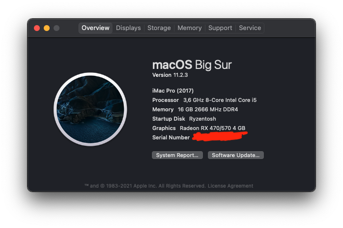
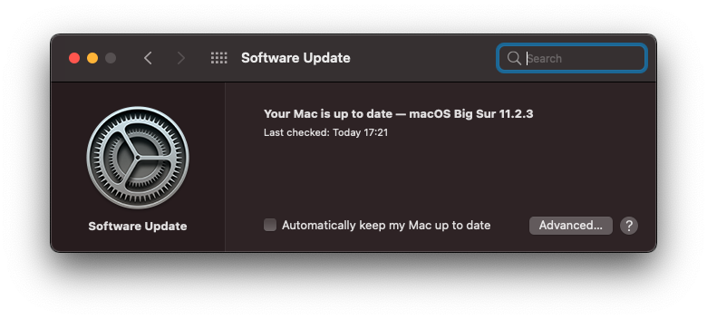
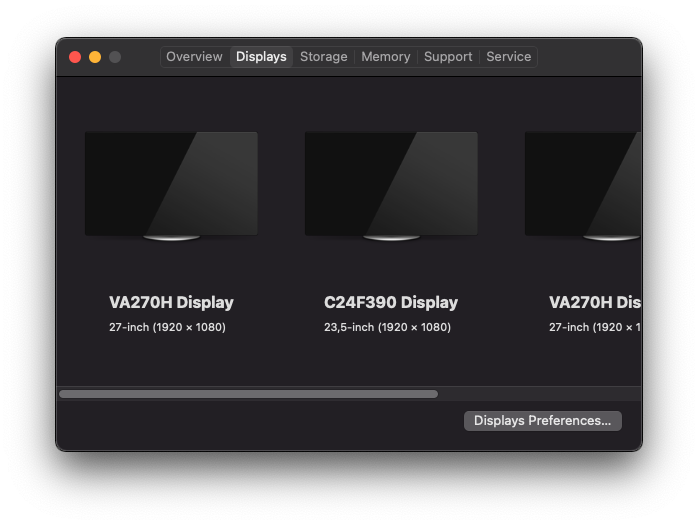
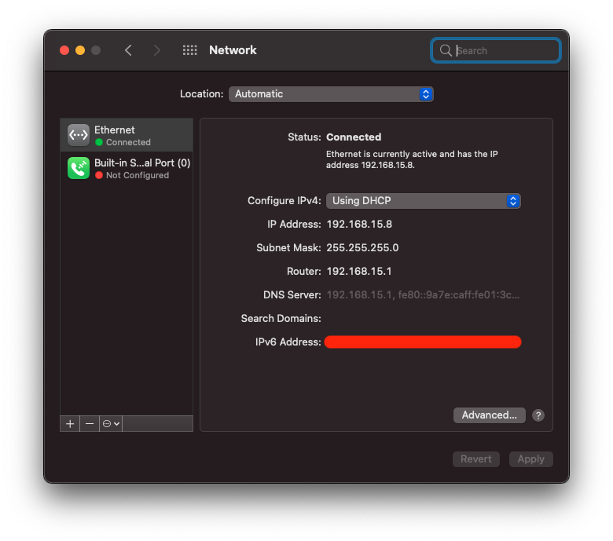
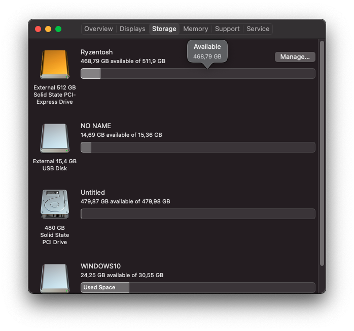
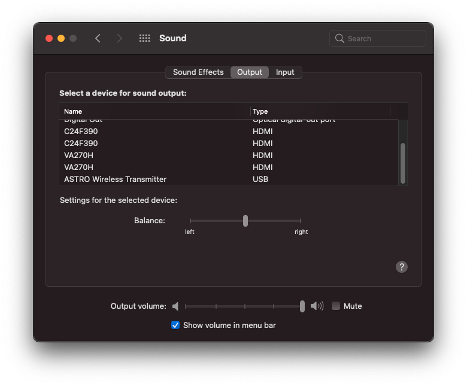
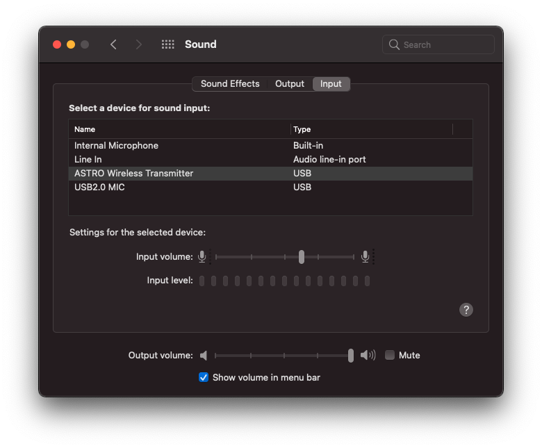
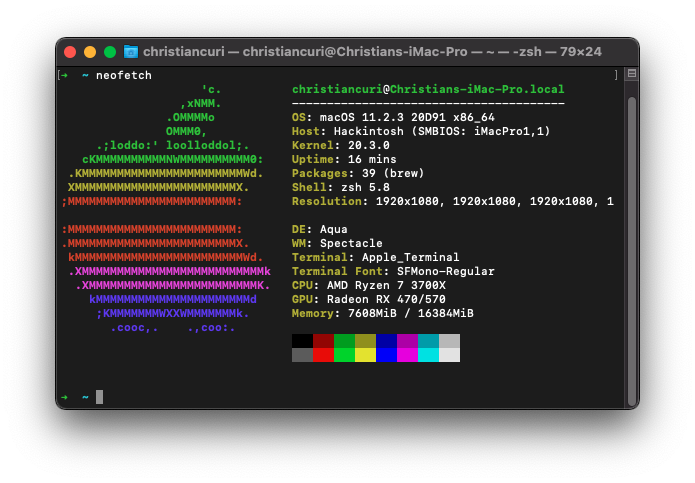

# Ryzentosh

### Supports MacOS 10.15.x ~ 11.0.x

## My System

- Ryzen 7 3700X
- RX 570 4GB
- 2 Displays 27" FHD
- 2 Displays 24" FHD
- 1 Display 27" FHD Ultra-Wide
- 16gb 2666mHZ of DDR4 RAM
- NVME m.2 512GB 
- Motherboard TUF Gaming B550M Plus
- Astro A50

## Important Note

- DWYOR!!!
- Enjoy it while we still can do this
- Set SATA mode to AHCI (Use CTRL+S in BIOS to unhide SATA Mode menu)
- Disable Secure Boot
- Generate new SMBIOS (https://github.com/corpnewt/GenSMBIOS)

## What's Working

- [x] Audio Output
- [x] Audio Input by USB
- [x] Dedicated Graphic Card
- [x] Ethernet
- [x] All Usb (3.2 gen1, 3.2 gen2)
- [x] System Update

## Not working

- Audio input by P2

## How to use
  1. Create directory "EFI" in your EFI partition (e.g. pendrive or hard drive)
  2. Clone this repo and paste directiories "BOOT" and "OC" onto created directory
  3. Download [**GenSMBIOS**](https://github.com/corpnewt/GenSMBIOS) to generate unique SMBIOS information. Run it and select **Generate SMBIOS**, as model select **iMacPro1,1**.
  4. Open config.plist with [**ProperTree**](https://github.com/corpnewt/ProperTree) and go to PlatformInfo > Generic. Set MLB (Board Serial), SystemSerialNumber (Serial) and SystemUUID (SmUUID) to generated values.
  5. Boot it! 

## Post install

- Ethernet 
	- Settings -> Network -> Ethernet -> Advenced -> Hardware: Set Configure from Automatically->Manually Then set Speed to 1000baseT, click ok and apply.

	- When firts install, you can set via terminal:

		`ifconfig en0 media 1000baseT`

	
