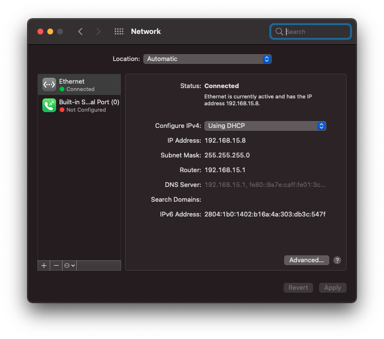

# Ryzentosh

### Supports MacOS 10.15.x ~ 11.0.x

## My System

- Ryzen 7 3700X
- RX 570 4GB
- 2 Displays 27" FHD
- 2 Displays 24" FHD
- 1 Display 27" FHD Ultra-Wide
- 16gb 2666mHZ of DDR4 RAM
- NVME m.2 512GB 
- Motherboard TUF Gaming B550M Plus
- Astro A50

## Important Note

- DWYOR!!!
- Enjoy it while we still can do this
- Set SATA mode to AHCI (Use CTRL+S in BIOS to unhide SATA Mode menu)
- Disable Secure Boot
- Generate new SMBIOS (https://github.com/corpnewt/GenSMBIOS)

## What's Working

- [x] Audio Output
- [x] Audio Input by USB
- [x] Dedicated Graphic Card
- [x] Ethernet
- [x] All Usb (3.2 gen1, 3.2 gen2)
- [x] System Update

## Not working

- Audio input by P2
